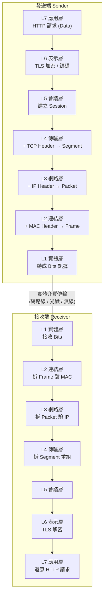
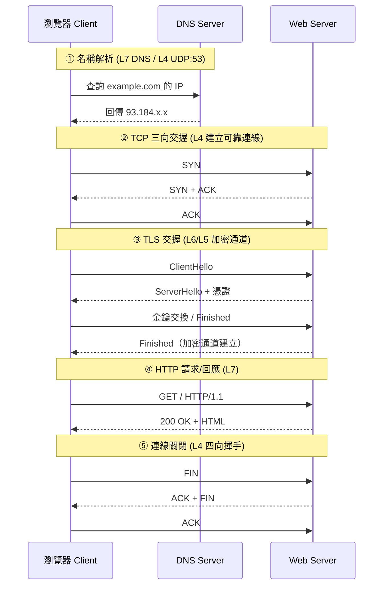
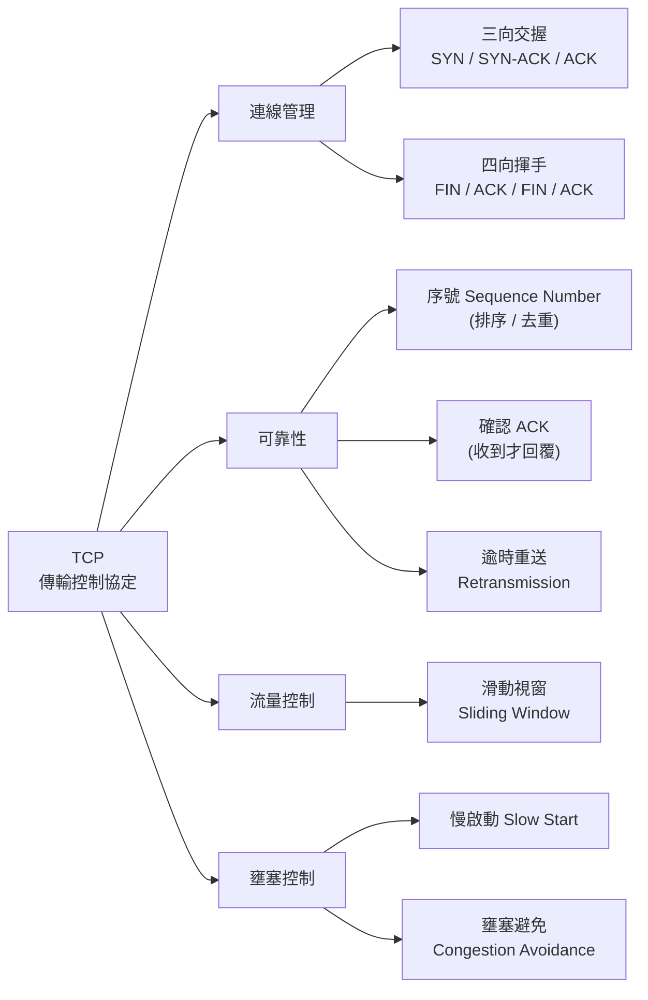
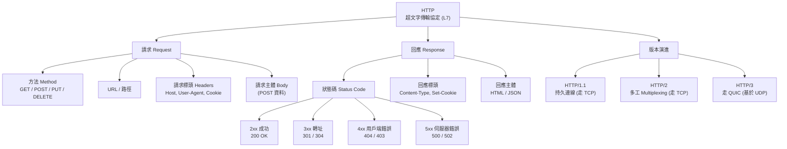
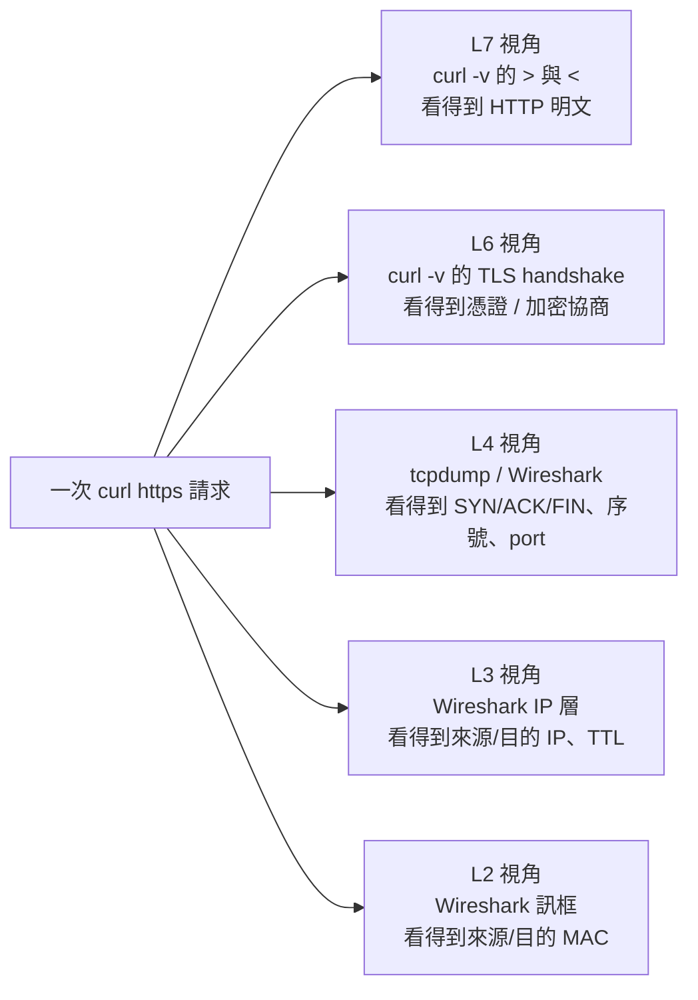

# 網路學習圖：OSI 七層 × TCP × HTTP

> 一份從「整體鏈路」到「關聯心智圖」的網路學習筆記。
> Mermaid 圖在 GitHub、VS Code（裝 Mermaid 外掛）、Obsidian 等皆可直接渲染。

---

## 1. OSI 七層模型總覽（由上而下）

| 層 | 名稱 | 主要職責 | 資料單位 (PDU) | 代表協定 / 範例 |
|----|------|----------|----------------|------------------|
| 7 | 應用層 Application | 提供使用者操作的網路服務介面 | Data | HTTP, HTTPS, DNS, FTP, SMTP |
| 6 | 表示層 Presentation | 編碼、加密、壓縮、格式轉換 | Data | TLS/SSL, JPEG, JSON, UTF-8 |
| 5 | 會議層 Session | 建立 / 維持 / 終止對話連線 | Data | TLS session, RPC, NetBIOS |
| 4 | 傳輸層 Transport | 端對端傳輸、可靠性、流量控制 | Segment (TCP) / Datagram (UDP) | **TCP**, UDP |
| 3 | 網路層 Network | 邏輯定址與路由（找路） | Packet | IP, ICMP, 路由器 Router |
| 2 | 資料連結層 Data Link | 實體定址、訊框、錯誤偵測 | Frame | Ethernet, MAC, 交換器 Switch |
| 1 | 實體層 Physical | 位元在介質上的傳輸 | Bit | 網路線, 光纖, 電壓訊號 |

---

## 2. 資料封裝鏈路圖（Encapsulation）

> 資料從「應用層往下送」會層層包裝表頭（Header），到對端再「往上拆解」。



---

## 3. 一次 HTTPS 請求的完整鏈路（時序圖）

> 以「瀏覽器打開 https://example.com」為例，串起 DNS → TCP → TLS → HTTP。



---

## 4. TCP 核心機制聚焦



| 特性 | TCP | UDP |
|------|-----|-----|
| 連線 | 連線導向（先交握） | 無連線 |
| 可靠性 | 保證送達、有序 | 不保證 |
| 速度 | 較慢（開銷大） | 快 |
| 用途 | HTTP, 檔案傳輸, Email | 直播, 遊戲, DNS, VoIP |

---

## 5. HTTP 核心結構聚焦



---

## 6. 關聯心智圖（Mind Map）

> 把 OSI、TCP、HTTP 三大主題的關聯一次串起來。

```mermaid
mindmap
  root((網路<br/>Networking))
    OSI 七層模型
      L1 實體層
        Bits / 網路線 / 光纖
      L2 資料連結層
        MAC / Frame / Switch
      L3 網路層
        IP / Router / 路由
      L4 傳輸層
        ::icon(fa fa-star)
        TCP
        UDP
      L5 會議層
        Session 管理
      L6 表示層
        TLS / 加密 / 編碼
      L7 應用層
        ::icon(fa fa-star)
        HTTP / HTTPS
        DNS / FTP / SMTP
    TCP 傳輸層
      連線
        三向交握
        四向揮手
      可靠性
        序號 / ACK / 重送
      控制
        流量控制 滑動視窗
        壅塞控制 慢啟動
      承載者
        HTTP 跑在 TCP 之上
    HTTP 應用層
      請求
        Method
        Headers
        Body
      回應
        2xx 3xx 4xx 5xx
      安全
        HTTPS = HTTP + TLS
      版本
        HTTP/1.1 → TCP
        HTTP/2 → TCP
        HTTP/3 → QUIC/UDP
    跨層關聯
      HTTP(L7) 依賴 TCP(L4)
      HTTPS 依賴 TLS(L6)
      TCP/UDP 依賴 IP(L3)
      IP 依賴 MAC(L2)
```

---

## 7. 一句話記憶法

- **OSI 由上到下助記**：`應 表 會 傳 網 連 實`（All People Seem To Need Data Processing）。
- **HTTP 與 TCP 的關係**：HTTP 是「信件內容」，TCP 是「掛號郵差」，IP 是「地址」，MAC 是「最後一哩的門牌」。
- **HTTPS = HTTP + TLS**：在 L6 加一層加密信封。
- **三向交握 vs 四向揮手**：開門握三次手，關門要揮四次手（因為關閉是雙向各自確認）。

---

## 8. `curl -v` 實際抓包對照各層

> 用 `curl -v https://example.com` 觀察一次完整請求，把輸出的每一段對應回 OSI 各層。
> （`-v` = verbose；想看更底層可加 `--trace-ascii out.txt`）

```bash
$ curl -v https://example.com
```

### 逐行對照表

| `curl -v` 輸出片段 | 含義 | 對應層 |
|---------------------|------|--------|
| `* Trying 93.184.216.34:443...` | DNS 已解析出 IP，準備連線（域名→IP 在 L7 DNS 完成，定址屬 L3） | L7 DNS → L3 IP |
| `* Connected to example.com (93.184.216.34) port 443` | TCP 三向交握完成，socket 建立 | **L4 TCP** |
| `* ALPN: offers h2,http/1.1` | 協商使用的 HTTP 版本 | L7 / L6 |
| `* TLSv1.3 (OUT), TLS handshake, ClientHello` | TLS 交握開始 | **L6 表示層 (TLS)** |
| `* Server certificate:` <br>`*  subject: CN=example.com` <br>`*  SSL certificate verify ok.` | 驗證伺服器憑證、建立加密通道 | L6 / L5 |
| `> GET / HTTP/2` <br>`> Host: example.com` <br>`> User-Agent: curl/8.x` | **送出** HTTP 請求行與請求標頭 | **L7 應用層 (HTTP)** |
| `< HTTP/2 200` <br>`< content-type: text/html` | **收到** HTTP 回應狀態碼與回應標頭 | **L7 應用層 (HTTP)** |
| `<!doctype html>...`（回應主體） | HTML 內容（Body） | L7 |
| `* Connection #0 to host example.com left intact` | TCP 連線保留（持久連線）或關閉時四向揮手 | L4 TCP |

### 符號速記

- `*` → curl 的**狀態 / 連線資訊**（多半是 L3/L4/L6 在做事）
- `>` → **送出**的內容（你的 HTTP 請求，L7）
- `<` → **收到**的內容（伺服器的 HTTP 回應，L7）

### 抓包視角對照（同一次請求，不同工具看到不同層）



### 進階指令對照

| 想看哪一層 | 指令 |
|------------|------|
| L7 HTTP 標頭與內容 | `curl -v https://example.com` |
| L7 只看回應標頭 | `curl -I https://example.com` |
| L6 TLS 憑證細節 | `openssl s_client -connect example.com:443` |
| L4 TCP 交握 / 序號 | `sudo tcpdump -i any host example.com -n` |
| L3/L4 完整封包逐欄位 | `sudo tshark -i any host example.com`（或 Wireshark GUI） |
| L3 路由路徑（逐跳） | `traceroute example.com` |
| L3 連通性 (ICMP) | `ping example.com` |

> 💡 重點：**`curl -v` 主要讓你看到 L7/L6**（HTTP + TLS）；要看到 **L4 以下的 SYN/ACK、IP、MAC**，得用 `tcpdump` / `tshark` / Wireshark 等抓包工具。

---

_學習筆記產出於 2026-06-14_
