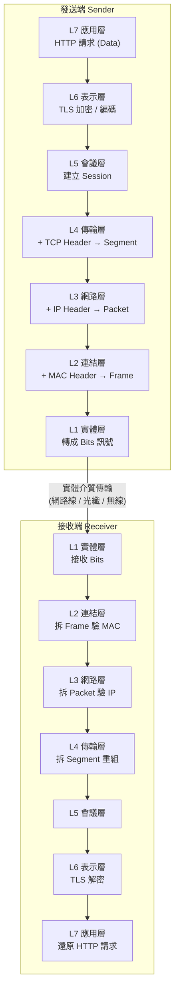
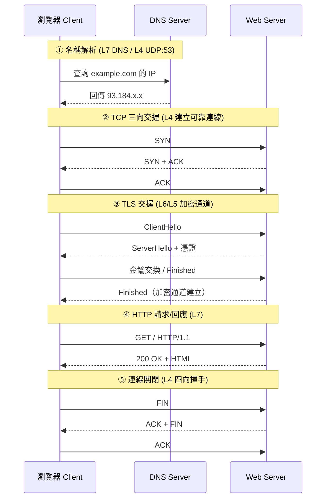
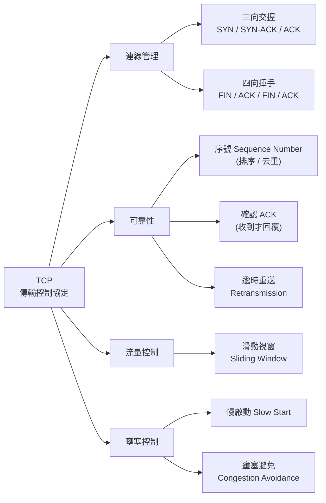
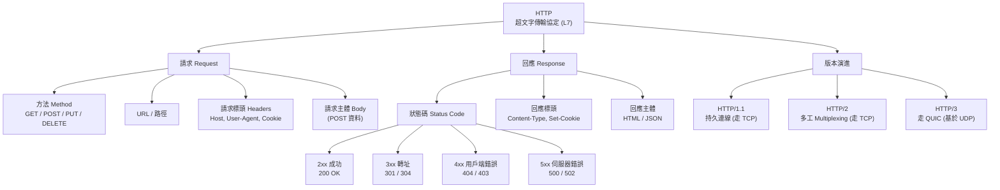
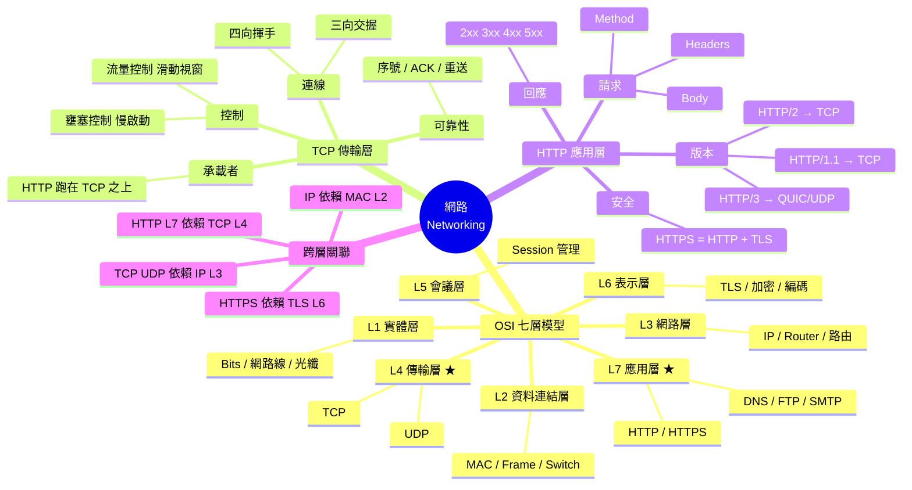
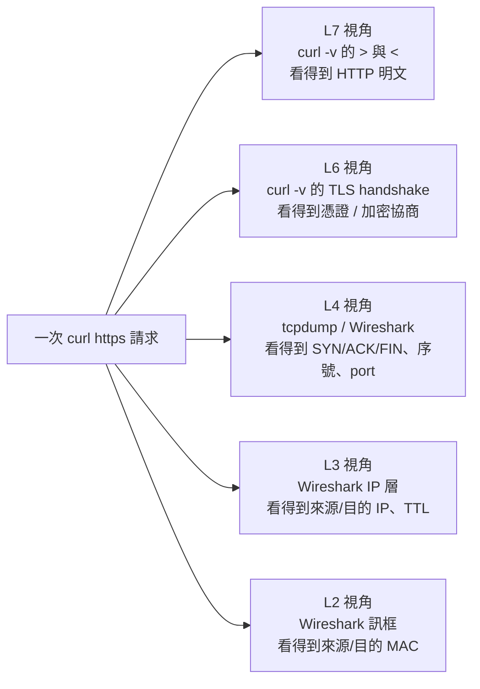

<a id="top"></a>

# 網路學習圖：OSI 七層 × TCP × HTTP

> 一份從「整體鏈路」到「關聯心智圖」的網路學習筆記。
> Mermaid 圖在 GitHub、VS Code（裝 Mermaid 外掛）、Obsidian 等皆可直接渲染。

---

## 1. OSI 七層模型總覽（由上而下）

| 層 | 名稱 | 主要職責 | 資料單位 (<a id="ref-pdu"></a>[PDU](#g-pdu)) | 代表協定 / 範例 |
|----|------|----------|----------------|------------------|
| 7 | 應用層 Application | 提供使用者操作的網路服務介面 | Data | <a id="ref-http"></a>[HTTP](#g-http), <a id="ref-https"></a>[HTTPS](#g-https), <a id="ref-dns"></a>[DNS](#g-dns), FTP, SMTP |
| 6 | 表示層 Presentation | 編碼、加密、壓縮、格式轉換 | Data | <a id="ref-tls"></a>[TLS/SSL](#g-tls), JPEG, JSON, UTF-8 |
| 5 | 會議層 Session | 建立 / 維持 / 終止對話連線 | Data | TLS session, RPC, NetBIOS |
| 4 | 傳輸層 Transport | 端對端傳輸、可靠性、流量控制 | Segment (<a id="ref-tcp"></a>[TCP](#g-tcp)) / Datagram (<a id="ref-udp"></a>[UDP](#g-udp)) | **TCP**, UDP |
| 3 | 網路層 Network | 邏輯定址與路由（找路） | Packet | <a id="ref-ip"></a>[IP](#g-ip), ICMP, 路由器 Router |
| 2 | 資料連結層 Data Link | 實體定址、訊框、錯誤偵測 | Frame | Ethernet, <a id="ref-mac"></a>[MAC](#g-mac), 交換器 Switch |
| 1 | 實體層 Physical | 位元在介質上的傳輸 | Bit | 網路線, 光纖, 電壓訊號 |

---

## 2. 資料封裝鏈路圖（Encapsulation）

> **<a id="ref-encap"></a>[封裝 Encapsulation](#g-encap)**：資料從「應用層往下送」會層層包裝表頭（Header），到對端再「往上拆解」。



---

## 3. 一次 HTTPS 請求的完整鏈路（時序圖）

> 以「瀏覽器打開 https://example.com」為例，串起 DNS → TCP → TLS → HTTP。



---

## 4. TCP 核心機制聚焦

> 關鍵詞：<a id="ref-seqack"></a>[序號 / ACK](#g-seqack)、<a id="ref-window"></a>[滑動視窗](#g-window)（流量控制）、<a id="ref-congestion"></a>[壅塞控制](#g-congestion)；連線靠 <a id="ref-port"></a>[Port](#g-port) 區分。



| 特性 | TCP | UDP |
|------|-----|-----|
| 連線 | 連線導向（先交握） | 無連線 |
| 可靠性 | 保證送達、有序 | 不保證 |
| 速度 | 較慢（開銷大） | 快 |
| 用途 | HTTP, 檔案傳輸, Email | 直播, 遊戲, DNS, VoIP |

---

## 5. HTTP 核心結構聚焦

> [HTTP](#g-http) 演進到 HTTP/3 改走 <a id="ref-quic"></a>[QUIC](#g-quic)（基於 UDP）。



---

## 6. 關聯心智圖（Mind Map）

> 把 OSI、TCP、HTTP 三大主題的關聯一次串起來。



---

## 7. 一句話記憶法

- **<a id="ref-osi"></a>[OSI](#g-osi) 由上到下助記**：`應 表 會 傳 網 連 實`（All People Seem To Need Data Processing）。
- **HTTP 與 TCP 的關係**：HTTP 是「信件內容」，TCP 是「掛號郵差」，IP 是「地址」，MAC 是「最後一哩的門牌」。
- **HTTPS = HTTP + TLS**：在 L6 加一層加密信封。
- **<a id="ref-3whs"></a>[三向交握](#g-3whs) vs <a id="ref-4wave"></a>[四向揮手](#g-4wave)**：開門握三次手，關門要揮四次手（因為關閉是雙向各自確認）。

---

## 8. `curl -v` 實際抓包對照各層

> 用 `curl -v https://example.com` 觀察一次完整請求，把輸出的每一段對應回 OSI 各層。
> （`-v` = verbose；想看更底層可加 `--trace-ascii out.txt`）

```bash
$ curl -v https://example.com
```

### 逐行對照表

| `curl -v` 輸出片段 | 含義 | 對應層 |
|---------------------|------|--------|
| `* Trying 93.184.216.34:443...` | DNS 已解析出 IP，準備連線（域名→IP 在 L7 DNS 完成，定址屬 L3） | L7 DNS → L3 IP |
| `* Connected to example.com (93.184.216.34) port 443` | TCP 三向交握完成，socket 建立 | **L4 TCP** |
| `* ALPN: offers h2,http/1.1` | <a id="ref-alpn"></a>[ALPN](#g-alpn) 協商使用的 HTTP 版本 | L7 / L6 |
| `* TLSv1.3 (OUT), TLS handshake, ClientHello` | TLS 交握開始 | **L6 表示層 (TLS)** |
| `* Server certificate:` <br>`*  subject: CN=example.com` <br>`*  SSL certificate verify ok.` | 驗證伺服器憑證、建立加密通道 | L6 / L5 |
| `> GET / HTTP/2` <br>`> Host: example.com` <br>`> User-Agent: curl/8.x` | **送出** HTTP 請求行與請求標頭 | **L7 應用層 (HTTP)** |
| `< HTTP/2 200` <br>`< content-type: text/html` | **收到** HTTP 回應狀態碼與回應標頭 | **L7 應用層 (HTTP)** |
| `<!doctype html>...`（回應主體） | HTML 內容（Body） | L7 |
| `* Connection #0 to host example.com left intact` | TCP 連線保留（持久連線）或關閉時四向揮手 | L4 TCP |

### 符號速記

- `*` → curl 的**狀態 / 連線資訊**（多半是 L3/L4/L6 在做事）
- `>` → **送出**的內容（你的 HTTP 請求，L7）
- `<` → **收到**的內容（伺服器的 HTTP 回應，L7）

### 抓包視角對照（同一次請求，不同工具看到不同層）



### 進階指令對照

| 想看哪一層 | 指令 |
|------------|------|
| L7 HTTP 標頭與內容 | `curl -v https://example.com` |
| L7 只看回應標頭 | `curl -I https://example.com` |
| L6 TLS 憑證細節 | `openssl s_client -connect example.com:443` |
| L4 TCP 交握 / 序號 | `sudo tcpdump -i any host example.com -n` |
| L3/L4 完整封包逐欄位 | `sudo tshark -i any host example.com`（或 Wireshark GUI） |
| L3 路由路徑（逐跳） | `traceroute example.com` |
| L3 連通性 (ICMP) | `ping example.com` |

> 💡 重點：**`curl -v` 主要讓你看到 L7/L6**（HTTP + TLS）；要看到 **L4 以下的 SYN/ACK、IP、MAC**，得用 `tcpdump` / `tshark` / Wireshark 等抓包工具。

---

## 📖 專有名詞解釋（Glossary）

> 內文中**標成連結的專有名詞，點一下即可跳到這裡**查看解釋；下方快速導覽也可直接點。每則解釋末尾的 [↑ 回頂部](#top) 可回到本頁開頭。

**快速導覽**：
[OSI](#g-osi) · [PDU](#g-pdu) · [封裝 Encapsulation](#g-encap) · [MAC](#g-mac) · [IP](#g-ip) · <a id="ref-arp"></a>[ARP](#g-arp) · [TCP](#g-tcp) · [UDP](#g-udp) · [三向交握](#g-3whs) · [四向揮手](#g-4wave) · [序號 / ACK](#g-seqack) · [滑動視窗](#g-window) · [壅塞控制](#g-congestion) · [TLS / SSL](#g-tls) · [HTTP](#g-http) · [HTTPS](#g-https) · [DNS](#g-dns) · [ALPN](#g-alpn) · [QUIC](#g-quic) · [Port](#g-port)

---

- <a id="g-osi"></a>**OSI 七層模型**　把網路通訊切成 7 個職責分明的層（實體→應用），讓不同廠商的設備能互通；實務上常與精簡的 TCP/IP 四層模型對照理解。　<sub>[↩ 回到出處](#ref-osi)</sub>
- <a id="g-pdu"></a>**PDU（Protocol Data Unit）**　每一層處理的「資料單位」名稱：L4 是 Segment、L3 是 Packet、L2 是 Frame、L1 是 Bit。　<sub>[↩ 回到出處](#ref-pdu)</sub>
- <a id="g-encap"></a>**封裝（Encapsulation）**　資料往下層傳時，每層各加上自己的表頭（Header）層層包裝；到對端再逐層拆解還原。　<sub>[↩ 回到出處](#ref-encap)</sub>
- <a id="g-mac"></a>**MAC 位址**　網卡的實體位址（L2），用於「同一個區網內」的定址；只在當前這一段鏈路有意義，過了路由器就會被改寫。　<sub>[↩ 回到出處](#ref-mac)</sub>
- <a id="g-ip"></a>**IP 位址**　網路層（L3）的邏輯位址，負責跨網段的「找路」(路由)；端對端通訊時 IP 通常不變。　<sub>[↩ 回到出處](#ref-ip)</sub>
- <a id="g-arp"></a>**ARP（Address Resolution Protocol）**　在區網內用「IP」問出對應「MAC」的協定（廣播：誰是 X？我是，MAC 給你）。　<sub>[↑ 回頂部](#top)</sub>
- <a id="g-tcp"></a>**TCP（傳輸控制協定）**　連線導向的傳輸層協定，提供可靠、有序、不重複的位元流；靠序號、ACK、重送、流量/壅塞控制達成。HTTP 多數版本跑在它之上。　<sub>[↩ 回到出處](#ref-tcp)</sub>
- <a id="g-udp"></a>**UDP（使用者資料包協定）**　無連線、不保證送達但快、開銷小；適合直播、遊戲、DNS、VoIP。　<sub>[↩ 回到出處](#ref-udp)</sub>
- <a id="g-3whs"></a>**三向交握（Three-way Handshake）**　TCP 建立連線的步驟：SYN → SYN+ACK → ACK，雙方各自確認「我能送、你能收」。　<sub>[↩ 回到出處](#ref-3whs)</sub>
- <a id="g-4wave"></a>**四向揮手（Four-way Handshake）**　TCP 關閉連線：FIN → ACK → FIN → ACK；因為兩個方向各自獨立關閉，所以要四次。　<sub>[↩ 回到出處](#ref-4wave)</sub>
- <a id="g-seqack"></a>**序號 / ACK（Sequence Number / Acknowledgement）**　序號讓接收端把封包排序去重；ACK 是「我收到了」的確認，沒收到就觸發重送。　<sub>[↩ 回到出處](#ref-seqack)</sub>
- <a id="g-window"></a>**滑動視窗（Sliding Window）**　TCP 的流量控制：接收方告知還能收多少，發送方據此控制「一次最多送多少未確認的資料」。　<sub>[↩ 回到出處](#ref-window)</sub>
- <a id="g-congestion"></a>**壅塞控制（Congestion Control）**　避免塞爆網路的機制，如慢啟動（Slow Start）、壅塞避免；和流量控制（保護接收端）是兩件事。　<sub>[↩ 回到出處](#ref-congestion)</sub>
- <a id="g-tls"></a>**TLS / SSL**　位於 L6 的加密協定，為連線提供加密、完整性與身分驗證（憑證）。SSL 是舊稱，現多用 TLS。　<sub>[↩ 回到出處](#ref-tls)</sub>
- <a id="g-http"></a>**HTTP（超文字傳輸協定）**　L7 應用層協定，用請求（Method/Headers/Body）與回應（狀態碼/Headers/Body）溝通；本身無狀態。　<sub>[↩ 回到出處](#ref-http)</sub>
- <a id="g-https"></a>**HTTPS**　HTTP + TLS：在 L6 加一層加密信封，等於「加密版 HTTP」。　<sub>[↩ 回到出處](#ref-https)</sub>
- <a id="g-dns"></a>**DNS（網域名稱系統）**　把人類好記的域名（example.com）解析成 IP；多數查詢走 UDP:53。　<sub>[↩ 回到出處](#ref-dns)</sub>
- <a id="g-alpn"></a>**ALPN（Application-Layer Protocol Negotiation）**　TLS 交握時順便協商要用哪個應用協定（如 h2 / http/1.1）的擴充。　<sub>[↩ 回到出處](#ref-alpn)</sub>
- <a id="g-quic"></a>**QUIC**　Google 提出、跑在 UDP 之上的傳輸協定，內建加密與多工，是 HTTP/3 的底層，解決 TCP 的隊頭阻塞。　<sub>[↩ 回到出處](#ref-quic)</sub>
- <a id="g-port"></a>**Port（連接埠）**　L4 用來區分同一台主機上不同服務/連線的編號（如 HTTP:80、HTTPS:443）。　<sub>[↩ 回到出處](#ref-port)</sub>

---

_學習筆記產出於 2026-06-14_
