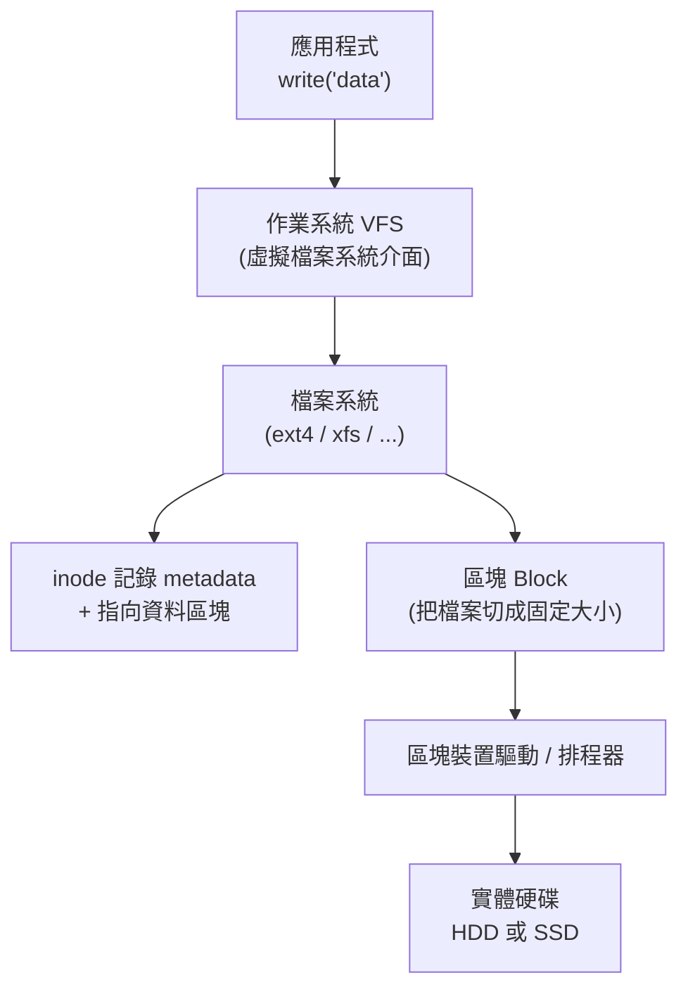
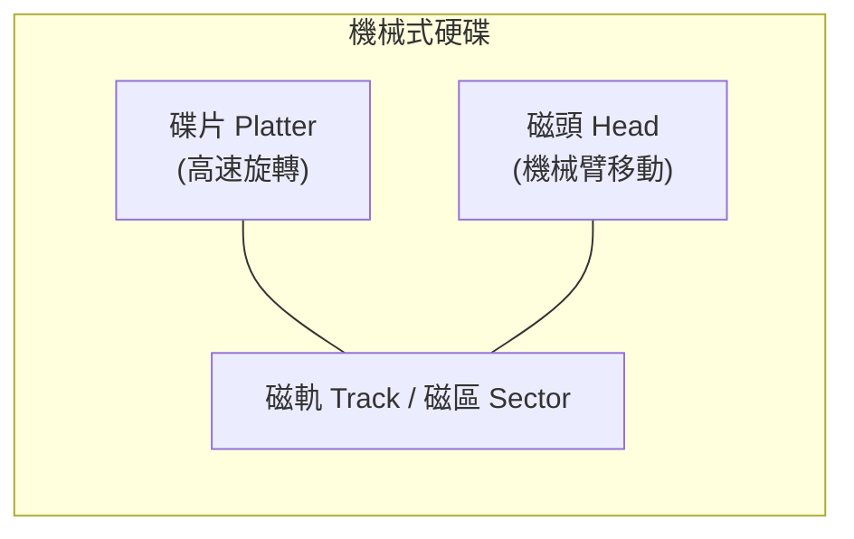
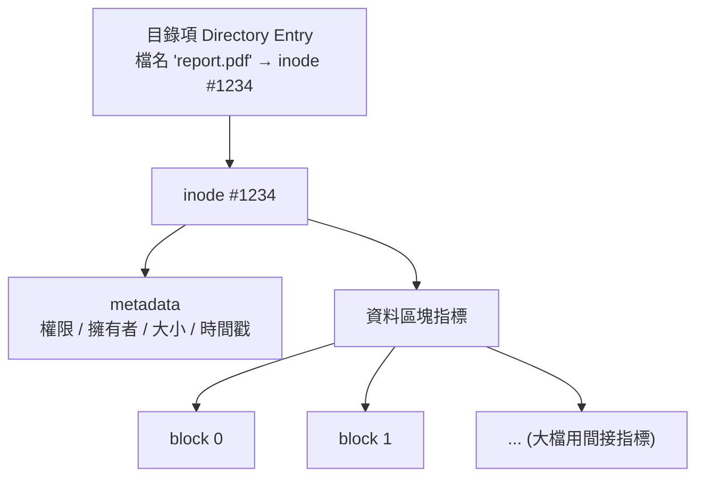
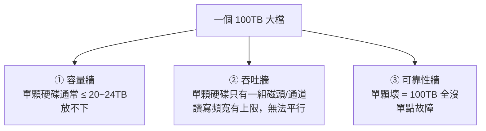
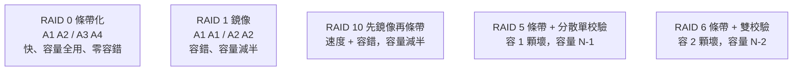
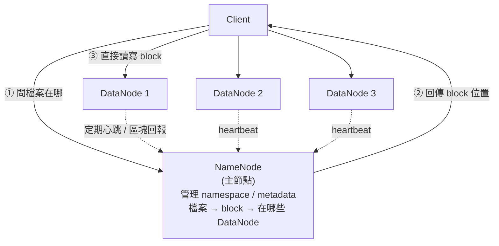
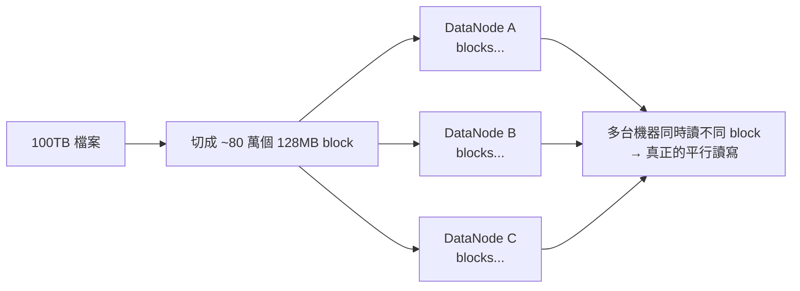

# 儲存深入：從硬碟原理、檔案系統、RAID，到分散式的 HDFS

> 一個 100TB 的大檔，為什麼單台 Linux 機器「塞不下、也讀不快」？
> 答案會帶你從**單顆硬碟的物理極限**，一路走到**多顆硬碟並行（RAID）**，再到**多台機器並行（HDFS）**。
>
> 給資深前端 / 想補架構底層的你：理解資料最終「躺在哪、怎麼讀寫」。

---

## 0. 全景：一筆資料如何落到硬碟

> 重點：應用程式看到的是「檔案」，但底層其實是**一堆固定大小的[區塊 (block)](#g-block)**，散落在硬碟上，由**[檔案系統](#g-fs)**用 **[inode](#g-inode)** 把它們組織起來。

---

## 1. 硬碟原理：機械式 (HDD) vs 固態 (SSD)

### 1-1. 機械式硬碟 HDD（Hard Disk Drive）

- 靠**碟片旋轉** + **磁頭機械臂移動**來定位資料。
- **[尋道時間 (seek time)](#g-seek)**：磁頭移到目標磁軌的時間 + 碟片轉到目標磁區的延遲。這是 HDD 慢的根源。
- **順序讀寫快、隨機讀寫慢**：因為隨機存取要不斷移動磁頭（毫秒級），順序存取則磁頭幾乎不動。
- 便宜、容量大，適合冷資料 / 大容量備份。

### 1-2. 固態硬碟 SSD（Solid State Drive）

- 用 **NAND 快閃記憶體**儲存，**沒有機械臂、沒有尋道**，隨機存取極快（微秒級）。
- 以「頁 (page) 寫入、區塊 (block) 抹除」為單位 → 衍生幾個特性：
  - **[寫入放大 (Write Amplification)](#g-wa)**：實際寫入快閃的資料量 > 應用要寫的量（因為要先搬移、再抹除整塊）。
  - **[磨損平衡 (Wear Leveling)](#g-wear)**：每個區塊有抹寫次數壽命，控制器讓寫入平均分散，避免局部寫爆。
  - **[TRIM](#g-trim)**：作業系統告訴 SSD「這些區塊的資料已刪除」，讓它能提前回收、維持效能。

### 1-3. HDD vs SSD 對照

| | [HDD](#g-hdd) 機械式 | [SSD](#g-ssd) 固態 |
|---|---|---|
| 機制 | 碟片旋轉 + 磁頭 | NAND 快閃，無機械 |
| 隨機存取 | 慢（毫秒，受尋道限制） | 快（微秒） |
| 順序吞吐 | 中等 | 高 |
| 單位成本 | 低（便宜大碗） | 高（漸降） |
| 壽命特性 | 機械磨損 | 抹寫次數有限，需磨損平衡 |
| 適用 | 大容量冷儲存、備份 | OS / 資料庫 / 熱資料 |

---

## 2. 檔案系統原理與 inode

### 2-1. 檔案系統在做什麼

把一顆「只會讀寫區塊」的硬碟，包裝成人類好用的「**檔案 + 目錄**」抽象。它要管理：命名、目錄樹、哪些區塊已用/可用、每個檔案的 metadata。

### 2-2. inode 是什麼

**inode（index node）= 一個檔案的「身分證 + 地圖」**，存的是 metadata 與「資料區塊在哪」的指標，但**不含檔名**。

關鍵觀念：
- **檔名存在「目錄項」裡，不在 inode**。所以同一個 inode 可被多個檔名指向（這就是**[硬連結 hard link](#g-hardlink)**）。
- 大檔案的區塊太多，inode 用「**間接指標 (indirect block)**」一層層指出去（直接指標 → 一級間接 → 二級間接…）。
- **inode 數量在格式化時就固定**：小檔太多時，可能「**容量還沒滿，inode 卻先用光**」→ 無法再建檔（`No space left on device` 但 `df` 顯示還有空間，`df -i` 才看得到）。

---

## 3. 為什麼單機 Linux 難以「高效處理」一個 100TB 大檔？

你提到「Linux 無法完成大檔的高效/並行讀寫」——更精確地說，**單機單碟有三道牆**：

1. **容量牆**：一個檔案要連續放在一個檔案系統上，但單顆硬碟容量有限；即使檔案系統理論上限很大（如 ext4 單檔上限 16TB、xfs 更大），實體硬碟也裝不下 100TB。
2. **吞吐牆**：單顆硬碟只有一組讀寫通道，吞吐量固定（HDD 約 100~250 MB/s）。100TB 就算用滿，光循序讀一遍也要好幾天，**無法靠單碟平行加速**。
3. **可靠性牆**：所有資料壓在一顆硬碟，壞了就全毀。

> **解法的兩個方向**：
> - 把資料**打散到多顆硬碟並行** → **[RAID](#g-raid)**（解決單機的吞吐/容量/可靠性）。
> - 把資料**打散到多台機器並行** → **[分散式檔案系統](#g-dfs) / HDFS**（解決跨機叢集的超大規模）。

---

## 4. RAID 硬碟陣列：用多顆硬碟組成一個邏輯卷

RAID 把多顆實體硬碟組成「一顆」邏輯硬碟，靠三種基本手法組合出不同特性：

- **[條帶化 (Striping)](#g-stripe)**：把資料切片輪流寫到不同硬碟 → **並行加速**。
- **[鏡像 (Mirroring)](#g-mirror)**：同一份資料寫到兩顆 → **冗餘備份**。
- **[奇偶校驗 (Parity)](#g-parity)**：算出校驗碼分散存放 → **用較少空間換容錯**。

### 4-1. 各級 RAID 在做什麼

- **[RAID 0（條帶化）](#g-raid0)**：純粹追求速度與容量，資料分散到所有硬碟並行讀寫。**沒有任何冗餘**，任一顆壞 → 全部資料毀。
- **[RAID 1（鏡像）](#g-raid1)**：兩顆硬碟存完全相同的資料。**壞一顆還有另一顆**，讀取可加速，但容量只剩一半。
- **[RAID 10（1+0）](#g-raid10)**：先把硬碟兩兩做鏡像，再把這些鏡像對做條帶化。**兼顧高速與容錯**，是資料庫常用方案，代價是容量減半。
- **[RAID 5（分散式單校驗）](#g-raid5)**：至少 3 顆，資料條帶化之外，額外算一份**奇偶校驗**分散存在各碟。**可容忍任 1 顆損壞**（用校驗碼重建），容量 = (N−1) 顆。寫入時要更新校驗，有「寫入懲罰」。
- **[RAID 6（雙校驗）](#g-raid6)**：類似 RAID 5 但有**兩份**校驗，**可容忍任 2 顆同時損壞**，容量 = (N−2) 顆。適合大容量陣列（重建時間長，期間怕第二顆再壞）。

### 4-2. RAID 對照表

| RAID | 最少硬碟 | 可用容量 | 容錯 | 讀 / 寫 | 適用 |
|------|----------|----------|------|---------|------|
| **0** | 2 | 100%（N 顆） | ❌ 0 顆 | 讀快 / 寫快 | 暫存、追求極速、可重建的資料 |
| **1** | 2 | 50%（1 顆） | ✅ 1 顆 | 讀快 / 寫普通 | 系統碟、重要小容量資料 |
| **10** | 4 | 50% | ✅ 每組鏡像各 1 顆 | 讀快 / 寫快 | 資料庫、高 IOPS + 要容錯 |
| **5** | 3 | N−1 顆 | ✅ 1 顆 | 讀快 / 寫有懲罰 | 容量與容錯平衡的檔案伺服器 |
| **6** | 4 | N−2 顆 | ✅ 2 顆 | 讀快 / 寫懲罰更大 | 大容量陣列、重建期要更安全 |

> 一句話：**0 求快、1 求穩、10 又快又穩(但貴)、5 省空間容 1 顆、6 省空間容 2 顆**。
> 注意：RAID **不是備份**——它防硬碟故障，不防誤刪/勒索病毒/機房災難。

---

## 5. 分散式檔案系統：Hadoop HDFS

當資料量超過「一台機器塞多少 RAID 都不夠」時，就要**橫向擴展到一整個叢集**。[HDFS（Hadoop Distributed File System）](#g-hdfs)就是為「一次寫入、多次讀取」的超大檔案設計的分散式檔案系統。

### 5-1. 核心架構：NameNode + DataNode

- **[NameNode（主節點）](#g-namenode)**：只存 **metadata**——目錄樹、檔案 → block 的映射、每個 block 在哪些 DataNode。它**不存實際資料**，但它是大腦，掛了整個叢集就停擺。
- **[DataNode（資料節點）](#g-datanode)**：實際儲存 **block** 的工人，定期向 NameNode 送**[心跳 (heartbeat)](#g-heartbeat)** 與**區塊回報**。某台掛了，NameNode 會把它上面的 block 從別的副本重新複製到健康節點。
- **Block（區塊）**：HDFS 把大檔切成**很大的塊（預設 128MB）**。大塊能降低 NameNode 的 metadata 數量、提高大檔的循序吞吐。
- **[副本 (Replication)](#g-replica)**：每個 block 預設存 **3 份**，分散在不同 DataNode（甚至不同機架），靠**[機架感知 (Rack Awareness)](#g-rack)** 策略放置，兼顧容錯與頻寬。

### 5-2. 100TB 大檔在 HDFS 怎麼被「並行」處理

這正好打破第 3 章的三道牆：
- **容量牆** → block 分散到上百台 DataNode，總容量隨機器數擴展。
- **吞吐牆** → 不同 block 在不同機器上，**可同時平行讀寫**（這也是 MapReduce / Spark「運算搬到資料旁」的基礎）。
- **可靠性牆** → 每 block 有 3 副本，壞幾台都能自動重建。

### 5-3. NameNode 的單點問題與 HA

NameNode 是單點，故有：
- **HA 高可用**：Active / Standby 兩個 NameNode + **JournalNode** 共享編輯日誌，主掛了自動切換。
- **早期的 Secondary NameNode**：不是備援，而是定期合併 metadata 日誌（fsimage + edits），減輕主節點負擔（常見誤解）。

---

## 6. 串起來：儲存的擴展之路

> 對前端 / 全端的延伸：你上傳大檔到 S3 用 **multipart upload（分片上傳）**，本質就是「把大檔切塊、平行傳、可斷點續傳」——和 HDFS 切 block、RAID 條帶化是同一套思維：**切片 + 並行 + 冗餘**。

---

## 7. 一句話總結

1. **HDD 慢在尋道、SSD 快但有抹寫壽命**；檔案系統用 **inode** 把區塊組織成檔案（檔名其實在目錄項裡）。
2. **單機單碟有容量/吞吐/可靠三道牆**，所以 100TB 大檔要靠「打散 + 並行」。
3. **RAID = 單機多碟**（0 快、1 穩、10 又快又穩、5 容 1、6 容 2）；**HDFS = 多機叢集**（NameNode 管 metadata、DataNode 存 block、預設 3 副本）。

---

## 📖 專有名詞解釋（Glossary）

> 內文中標成連結的專有名詞，點一下即可跳到這裡查看解釋。每則解釋末尾的 [↑ 回頂部](#top) 可回到本頁開頭。

**快速導覽**：
[檔案系統](#g-fs) · [HDD](#g-hdd) · [SSD](#g-ssd) · [尋道時間](#g-seek) · [寫入放大](#g-wa) · [磨損平衡](#g-wear) · [TRIM](#g-trim) · [inode](#g-inode) · [Block 區塊](#g-block) · [硬連結](#g-hardlink) · [條帶化](#g-stripe) · [鏡像](#g-mirror) · [奇偶校驗](#g-parity) · [RAID](#g-raid) · [RAID 0](#g-raid0) · [RAID 1](#g-raid1) · [RAID 10](#g-raid10) · [RAID 5](#g-raid5) · [RAID 6](#g-raid6) · [分散式檔案系統](#g-dfs) · [HDFS](#g-hdfs) · [NameNode](#g-namenode) · [DataNode](#g-datanode) · [副本](#g-replica) · [機架感知](#g-rack) · [心跳](#g-heartbeat)

---

- **檔案系統（File System）**　把「只會讀寫區塊」的硬碟包裝成「檔案 + 目錄」抽象的軟體層，管理命名、目錄樹、空間配置與 metadata（如 ext4、xfs）。　[↩ 回到出處](#ref-fs)
- **HDD（機械式硬碟）**　靠碟片旋轉 + 磁頭機械臂定位資料；順序快、隨機慢，便宜大容量，適合冷資料。　[↩ 回到出處](#ref-hdd)
- **SSD（固態硬碟）**　用 NAND 快閃儲存、無機械臂，隨機存取極快；但有抹寫壽命，需磨損平衡與 TRIM。　[↩ 回到出處](#ref-ssd)
- **尋道時間（Seek Time）**　HDD 磁頭移到目標磁軌（加上碟片旋轉到目標磁區）的延遲，是 HDD 隨機存取慢的主因。　[↩ 回到出處](#ref-seek)
- **寫入放大（Write Amplification）**　SSD 實際寫入快閃的資料量大於應用要寫的量，因為要先搬移有效資料再抹除整個區塊。　[↩ 回到出處](#ref-wa)
- **磨損平衡（Wear Leveling）**　SSD 控制器讓寫入平均分散到各區塊，避免某些區塊先被寫爆、延長整體壽命。　[↩ 回到出處](#ref-wear)
- **TRIM**　作業系統通知 SSD「某些區塊資料已刪除可回收」的指令，讓 SSD 提前整理、維持寫入效能。　[↩ 回到出處](#ref-trim)
- **inode（index node）**　檔案的 metadata（權限、擁有者、大小、時間戳）與指向資料區塊的指標集合；**不含檔名**（檔名在目錄項）。inode 數量在格式化時固定，小檔太多會先耗盡。　[↩ 回到出處](#ref-inode)
- **Block（區塊）**　檔案系統 / 硬碟讀寫的固定大小單位；檔案被切成多個 block 散放，由 inode 指標串起來。　[↩ 回到出處](#ref-block)
- **硬連結（Hard Link）**　多個檔名（目錄項）指向同一個 inode；因此檔名與檔案內容是分離的。　[↩ 回到出處](#ref-hardlink)
- **條帶化（Striping）**　把資料切片輪流寫到多顆硬碟，讓讀寫能並行加速；RAID 0/5/6/10 都用到。　[↩ 回到出處](#ref-stripe)
- **鏡像（Mirroring）**　同一份資料同時寫到兩顆硬碟，提供冗餘容錯；RAID 1/10 的核心。　[↩ 回到出處](#ref-mirror)
- **奇偶校驗（Parity）**　用 XOR 等運算算出校驗碼分散儲存，硬碟壞掉時可反推重建資料，用較少空間換容錯；RAID 5/6 的核心。　[↩ 回到出處](#ref-parity)
- **RAID（磁碟陣列）**　把多顆實體硬碟組成一個邏輯卷，用條帶化 / 鏡像 / 校驗的組合，換取速度、容量或容錯。　[↩ 回到出處](#ref-raid)
- **RAID 0**　純條帶化：快、容量全用，但**零容錯**，任一顆壞全毀。　[↩ 回到出處](#ref-raid0)
- **RAID 1**　純鏡像：可容 1 顆壞、讀取可加速，但容量只剩一半。　[↩ 回到出處](#ref-raid1)
- **RAID 10（1+0）**　先鏡像再條帶：兼顧高速與容錯，容量減半，資料庫常用。　[↩ 回到出處](#ref-raid10)
- **RAID 5**　條帶 + 分散式單奇偶校驗：至少 3 顆，可容 1 顆壞，可用容量 N−1，寫入有校驗懲罰。　[↩ 回到出處](#ref-raid5)
- **RAID 6**　條帶 + 雙奇偶校驗：至少 4 顆，可容 2 顆同時壞，可用容量 N−2，適合大容量陣列。　[↩ 回到出處](#ref-raid6)
- **分散式檔案系統（Distributed File System）**　把檔案切塊分散儲存到多台機器，對使用者呈現單一檔案系統視圖，可橫向擴展容量與吞吐。　[↩ 回到出處](#ref-dfs)
- **HDFS（Hadoop Distributed File System）**　為「一次寫入、多次讀取」的超大檔案設計的分散式檔案系統，由 NameNode + DataNode 組成。　[↩ 回到出處](#ref-hdfs)
- **NameNode（主節點）**　只存 metadata（目錄樹、檔案→block 映射、block 位置），是 HDFS 的大腦；單點故障靠 HA（Active/Standby + JournalNode）解決。　[↩ 回到出處](#ref-namenode)
- **DataNode（資料節點）**　實際儲存 block 的工人節點，定期向 NameNode 送心跳與區塊回報。　[↩ 回到出處](#ref-datanode)
- **副本（Replication）**　HDFS 每個 block 預設存 3 份在不同節點/機架，提供容錯與讀取頻寬。　[↩ 回到出處](#ref-replica)
- **機架感知（Rack Awareness）**　HDFS 放置副本時考慮機架拓樸（不把 3 份全放同一機架），兼顧容錯與跨機架頻寬。　[↩ 回到出處](#ref-rack)
- **心跳（Heartbeat）**　DataNode 定期回報「我還活著 + 我有哪些 block」給 NameNode；停止心跳即視為節點失效，觸發副本重建。　[↩ 回到出處](#ref-heartbeat)

---

_學習筆記產出於 2026-06-14 · 主題：硬碟 / 檔案系統 / RAID / 分散式儲存_
