

# 負載平衡深入：從一次搜尋，到鏈路層改寫 MAC 的 Direct Routing

> 場景：你在 **淘寶** 或 **Google** 搜尋框打字按下 Enter。
> 這個請求怎麼穿過鏈路層、抵達[負載平衡器（Load Balancer, LB）](#g-lb)、再被分流到某一台後端伺服器？
> 為什麼大廠要「直接路由 + 改寫 MAC」？效益是什麼？還有哪些做法？
>
> 給已經熟悉前端的你，補齊**架構面 / 網路底層**的這一塊。

---

## 0. 先建立全景：一次搜尋的完整旅程

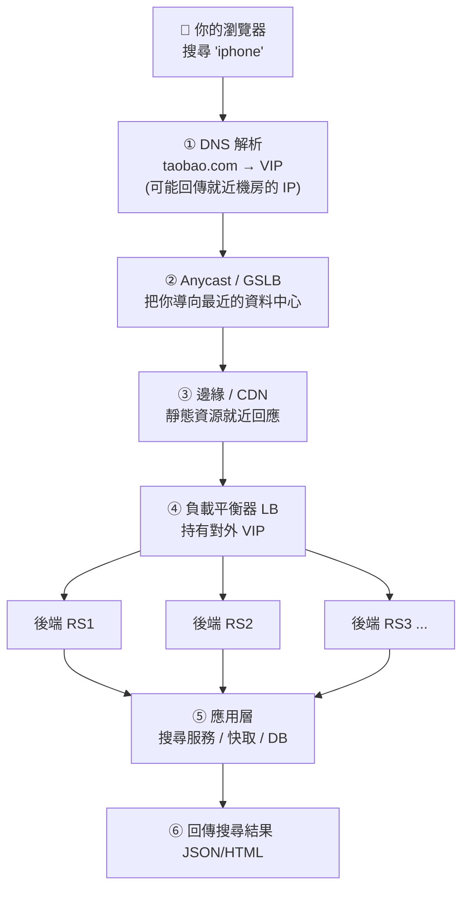

> 本篇聚焦在第 **④** 步：流量到了 LB 之後，**LB 用什麼手法把封包送到後端**，特別是「**改寫 MAC、走鏈路層直接轉發**」這一招。

---

## 1. 為什麼需要負載平衡？

| 目的 | 說明 |
|------|------|
| **水平擴展 (Scale out)** | 單機撐不住搜尋流量，用一群機器分攤 |
| **高可用 (HA)** | 某台掛了，LB 自動把流量導到健康的機器 |
| **[健康檢查](#g-health)** | LB 定期探測後端，剔除壞掉的節點 |
| **隱藏拓樸** | 對外只暴露一個 [VIP（Virtual IP）](#g-vip)，後端 IP 不外露 |
| **彈性** | 尖峰加機器、離峰縮機器，對使用者無感 |

> 對前端的類比：就像你在 CDN/反向代理後面放多台 Node 服務，差別在於**大廠的 LB 要扛每秒數百萬連線**，所以連「封包怎麼轉發」都要榨乾效能 → 才有了改寫 MAC 這種底層手法。

---

## 2. 關鍵分水嶺：L4 vs L7 負載平衡

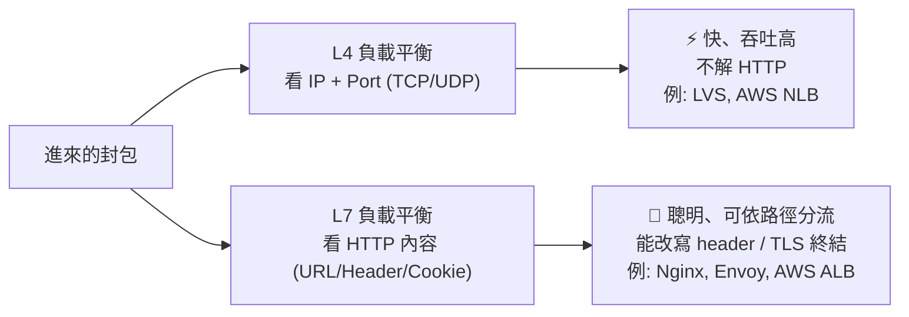

| | **[L4](#g-l4l7) (傳輸層)** | **[L7](#g-l4l7) (應用層)** |
|---|---|---|
| 看什麼 | IP、Port | URL、Host、Cookie、Header |
| 能力 | 純轉發 | 路徑分流、A/B、改寫、TLS 終結 |
| 效能 | 極高（不拆 HTTP） | 較低（要解析 HTTP） |
| 代表 | **LVS**、AWS NLB、F5 | Nginx、Envoy、HAProxy、AWS ALB |
| 典型位置 | 最前面、抗大流量 | LVS 後面、做精細路由 |

> 大型架構常見**兩層**：最前面用 **L4（LVS）抗量**，後面接一排 **L7（Nginx/Envoy）做精細路由**。本篇的「改寫 MAC」就是 **L4 LVS** 的招式。

---

## 3. 主角登場：LVS 的三種轉發模式

[LVS（Linux Virtual Server）](#g-lvs)是 Linux 核心內建的 L4 負載平衡（[IPVS](#g-lvs) 模組）。它有三種把封包送到後端（[Real Server, RS](#g-rs)）的模式：

| 模式 | 手法 | 回應路徑 | 跨網段 | 吞吐 |
|------|------|----------|--------|------|
| **[NAT](#g-nat)** | 改寫目的 IP（像家用路由器） | 回應**要穿回 LB** | 可 | 低（LB 是瓶頸） |
| **[DR (Direct Routing)](#g-dr)** | **改寫目的 MAC**，IP 不動 | 後端**直接回客戶端** | 否（同網段） | **極高** ⭐ |
| **[TUN (IP Tunnel)](#g-tun)** | 把封包**再包一層 IP** 隧道 | 後端直接回客戶端 | 可（跨機房） | 高 |

下面三節逐一拆解。

---

### 3-1. NAT 模式（最直覺，但 LB 會塞車）

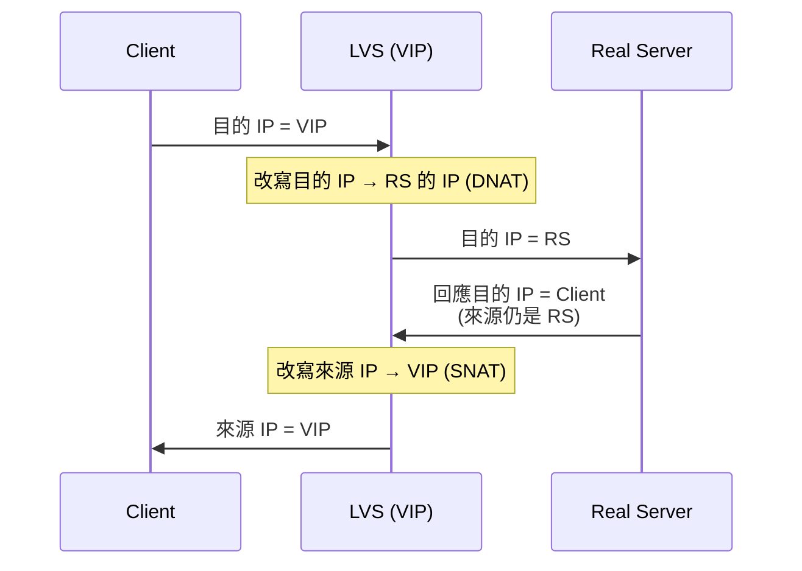

- **進、出都要經過 LB** → 回應流量（通常比請求大很多，例如搜尋結果頁）全壓在 LB 上。
- LB 成為頻寬瓶頸。這就是為什麼要 DR。

---

### 3-2. DR 模式（Direct Routing）— 改寫 MAC 的核心 ⭐

**核心觀念：LB 完全不碰 IP，只把封包在「鏈路層」改寫目的 MAC，丟給後端；後端回應時繞過 LB，直接回客戶端。**

#### 運作流程

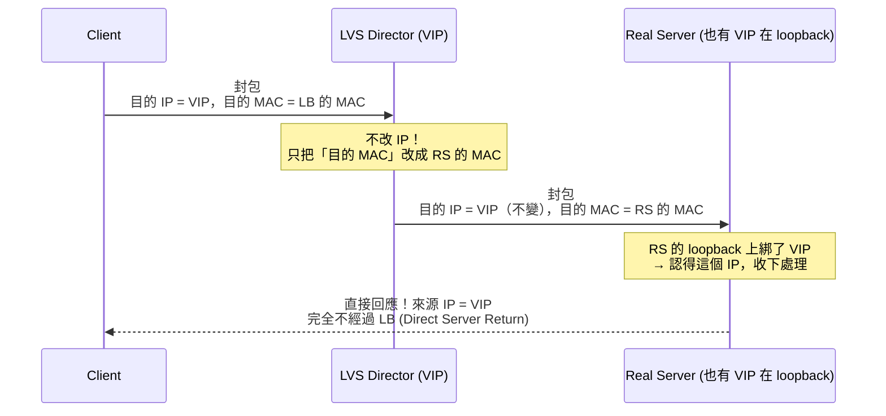

#### 圖解：封包頭的變化

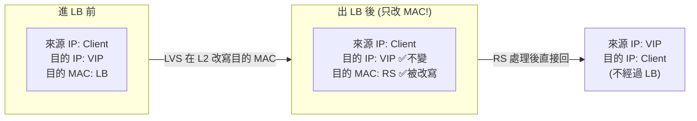

#### DR 模式的三個必要條件（也是常見坑）

1. **LB 與所有 RS 必須在同一個二層網段（同一個區網/VLAN）**
   - 因為改 MAC 的轉發只在同網段有效（鏈路層不跨路由器）。
2. **每台 RS 的 [loopback](#g-loopback) 介面要綁 VIP**
   - 這樣 RS 才認得「目的 IP = VIP」的封包是給自己的，否則會丟棄。
3. **必須[抑制 RS 對 VIP 的 ARP 回應](#g-arp)**（`arp_ignore` / `arp_announce`）
   - 否則客戶端的 ARP 廣播「誰是 VIP？」時，RS 也跳出來搶答，流量就不經過 LB 了，整個機制崩潰。

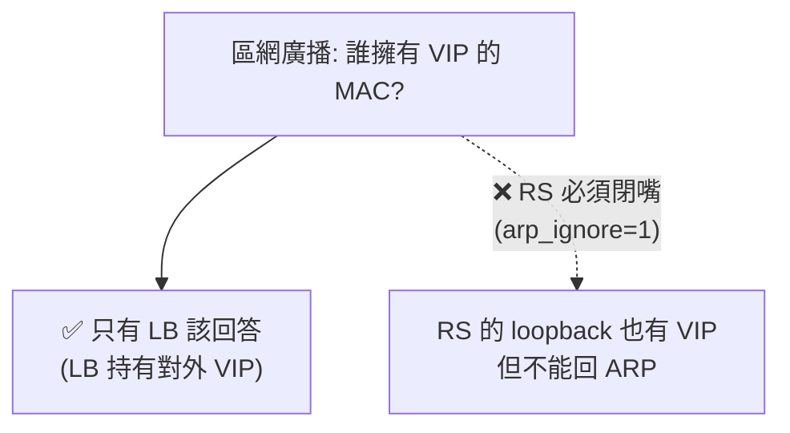

---

### 3-3. TUN 模式（IP 隧道，可跨機房）

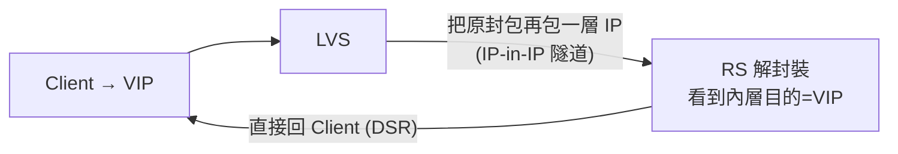

- 跟 DR 一樣是 **[Direct Server Return](#g-dsr)**（回應不經 LB）。
- 差別：用 **IP 隧道封裝**，所以 RS **可以跨網段、跨機房**，不必和 LB 同一個二層網段。
- 代價：多一層封裝，RS 要支援隧道解封裝。

---

## 4. 為什麼要「改寫 MAC / Direct Routing」？效益是什麼？

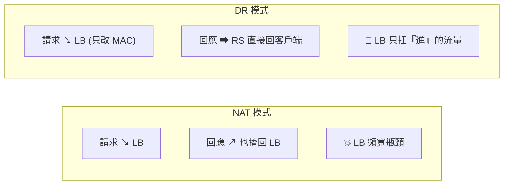

### 核心效益：**Direct Server Return (DSR)**

| 效益 | 說明 |
|------|------|
| **回應不經過 LB** | Web 流量「**回應遠大於請求**」（你打幾個字，回來一整頁）。讓回應繞過 LB，LB 負擔可能降到 1/10 以下 |
| **極高吞吐 / 低延遲** | LB 只改 MAC，不做 IP 改寫、不拆 TCP、不解 HTTP → 一台普通機器可扛數百萬連線 |
| **LB 不是頻寬瓶頸** | LB 只看「進站」流量，出站流量分散在各 RS 的網卡 |
| **後端水平擴展便宜** | 加 RS 幾乎線性提升總出站頻寬 |

> 一句話：**「進站集中分流、出站分散直回」**。這就是 DR 模式存在的理由。

---

## 5. 還有哪些做法？（架構師的工具箱）

負載平衡不只 LVS-DR 一種，依「在哪一層、靠什麼分流」可以排成一個光譜：

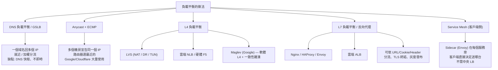

### 各做法速查表

| 做法 | 層級 | 分流依據 | 適合場景 | 注意 |
|------|------|----------|----------|------|
| **DNS / [GSLB](#g-gslb)** | — | 地理、加權 | 跨機房就近接入 | DNS 快取延遲、切換不即時 |
| **[Anycast](#g-anycast) + [ECMP](#g-ecmp)** | L3 | 路由就近 | 全球入口、抗 DDoS | 路由變動可能斷連線 |
| **LVS-NAT** | L4 | IP/Port | 小規模、簡單 | LB 是雙向瓶頸 |
| **LVS-DR** ⭐ | L2 | 改寫 MAC | 同機房、超高吞吐 | 須同網段、ARP 設定 |
| **LVS-TUN** | L3 | IP 隧道 | 跨機房 + DSR | RS 須支援隧道 |
| **[Maglev](#g-maglev)** | L4 | 一致性雜湊 | 超大規模、連線一致性 | Google 論文方案 |
| **Nginx/Envoy** | L7 | URL/Cookie | 微服務精細路由 | 要解析 HTTP，較重 |
| **[Service Mesh](#g-mesh)** | L7(客戶端) | 服務發現 | 微服務內部東西向流量 | 維運複雜度高 |

### 補充：一致性雜湊（為什麼大廠 L4 LB 愛用）

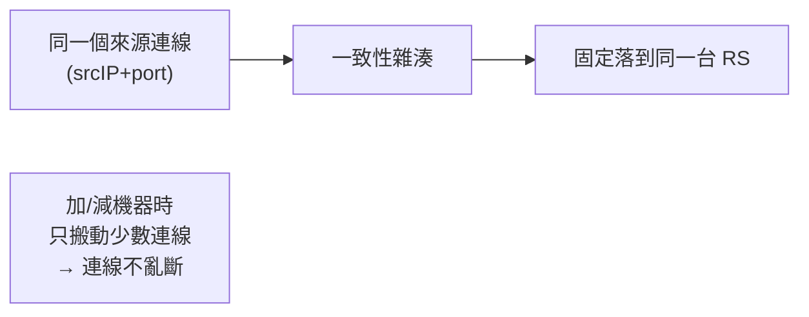

- 普通「輪詢 (round-robin)」在**加減機器**時會把大量既有連線打散。
- **[一致性雜湊 (consistent hashing)](#g-hash)** 讓同一個連線穩定落在同一台 RS，加減機器只影響少數連線。Google 的 **Maglev** 就是用這招做到「連線黏著」+「均勻分配」。

---

## 6. 對「資深前端」特別有感的延伸

這些底層概念，其實會直接影響你寫前端 / 部署的決策：

| 前端議題 | 背後的負載平衡關聯 |
|----------|---------------------|
| **WebSocket / SSE 長連線** | 需要 LB 支援「連線黏著」(sticky / 一致性雜湊)，否則重連可能落到別台 |
| **登入 session 飄移** | 多台後端時，session 要嘛存共享 store(Redis)，要嘛靠 [sticky session](#g-sticky)（Cookie 綁 LB） |
| **灰度發布 / A·B 測試** | 靠 **L7 LB**（Envoy/ALB）依 Header/Cookie 把你導到新版本 |
| **就近接入 / TTFB 優化** | 靠 **Anycast + GSLB + CDN**，本質也是負載平衡的一環 |
| **[TLS 終結](#g-tlsterm)在哪** | L7 LB 常負責 TLS 終結，後端走明文 → 影響你對 `X-Forwarded-*` header 的處理 |
| **取得真實 client IP** | DSR/代理會改寫來源資訊 → 後端要看 [`X-Forwarded-For`](#g-xff) / `Proxy Protocol` |

> 例：你做即時聊天用 WebSocket，部署到一群 Node 後面接 LB，如果 LB 用單純輪詢、又沒共享 session，使用者一斷線重連就「換了一台、狀態不見」——這就是負載平衡策略沒選對的後果。

---

## 7. 總結：一張圖記住

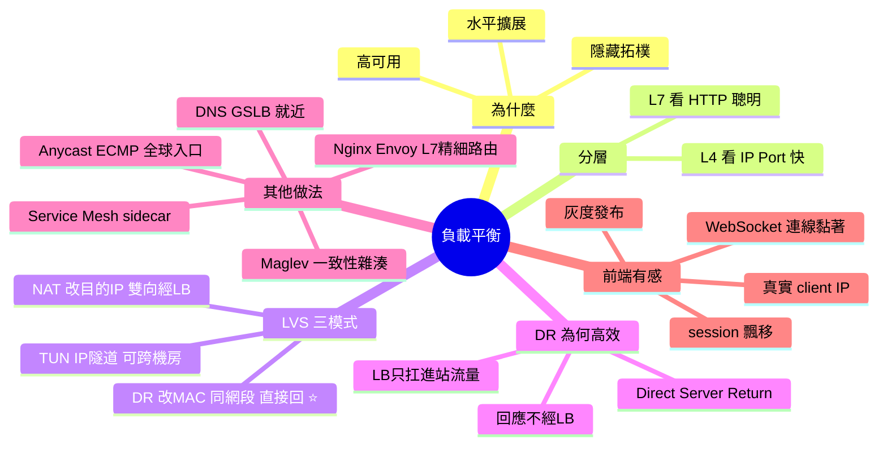

### 三句話帶走

1. **DR 模式 = 只改鏈路層的目的 MAC、IP 不動**，讓封包送到同網段的後端。
2. **效益是 Direct Server Return**：回應繞過 LB 直接回客戶端，LB 只扛「進站」流量，吞吐量爆增。
3. **沒有銀彈**：DR 要同網段、TUN 可跨機房、L7 能精細路由、Anycast 管全球入口——架構師依場景組合搭配。

---

## 📖 專有名詞解釋（Glossary）

> 內文中**標成連結的專有名詞，點一下即可跳到這裡**查看解釋；下方快速導覽也可直接點。每則解釋末尾的 [↑ 回頂部](#top) 可回到本頁開頭。

**快速導覽**：
[負載平衡 LB](#g-lb) · [VIP](#g-vip) · [Real Server](#g-rs) · [L4 / L7](#g-l4l7) · [LVS / IPVS](#g-lvs) · [NAT / DNAT / SNAT](#g-nat) · [DR 直接路由](#g-dr) · [TUN 隧道](#g-tun) · [DSR](#g-dsr) · [ARP 抑制](#g-arp) · [loopback](#g-loopback) · [Anycast](#g-anycast) · [ECMP](#g-ecmp) · [GSLB](#g-gslb) · [Maglev](#g-maglev) · [一致性雜湊](#g-hash) · [Service Mesh / Sidecar](#g-mesh) · [Sticky Session](#g-sticky) · [TLS 終結](#g-tlsterm) · [X-Forwarded-For](#g-xff) · [健康檢查](#g-health)

---

**負載平衡器（Load Balancer, LB）**　把進來的流量分攤到一群後端伺服器的設備/軟體，達成水平擴展、高可用與隱藏拓樸。　[↑ 回頂部](#top)

**VIP（Virtual IP，虛擬 IP）**　對外公開的單一服務 IP；客戶端只看得到 VIP，背後可對應一群後端。　[↑ 回頂部](#top)

**Real Server（RS，真實伺服器）**　LB 後面實際處理請求的後端機器。　[↑ 回頂部](#top)

**L4 / L7 負載平衡**　L4 只看 IP+Port 做純轉發（快、吞吐高）；L7 解析 HTTP（URL/Cookie/Header），能精細路由、改寫、TLS 終結。　[↑ 回頂部](#top)

**LVS / IPVS**　LVS（Linux Virtual Server）是 Linux 內建的 L4 負載平衡；IPVS 是其核心模組，支援 NAT / DR / TUN 三種轉發模式。　[↑ 回頂部](#top)

**NAT / DNAT / SNAT**　網路位址轉換。DNAT 改「目的 IP」(把 VIP 換成 RS)、SNAT 改「來源 IP」。LVS-NAT 模式進出都經過 LB，故 LB 易成瓶頸。　[↑ 回頂部](#top)

**DR（Direct Routing，直接路由）**　LVS 模式之一：**只改寫鏈路層的目的 MAC、IP 完全不動**，把封包丟給同網段的 RS；回應由 RS 直接回客戶端，不經 LB。吞吐最高。　[↑ 回頂部](#top)

**TUN（IP Tunnel，IP 隧道）**　LVS 模式之一：把原封包「再包一層 IP」送給 RS，因此 RS 可跨網段/機房；回應一樣直接回客戶端。　[↑ 回頂部](#top)

**DSR（Direct Server Return，直接回應）**　後端的回應**繞過 LB 直接回客戶端**。因 Web 回應遠大於請求，DSR 讓 LB 只扛進站流量，吞吐大增。DR / TUN 都屬於 DSR。　[↑ 回頂部](#top)

**ARP 抑制（arp_ignore / arp_announce）**　DR 模式必做設定：讓 RS 雖在 loopback 綁了 VIP，卻**不回應**「誰是 VIP？」的 ARP 廣播，確保只有 LB 收到外來流量。　[↑ 回頂部](#top)

**loopback（環回介面，lo）**　主機內部的虛擬網卡（127.0.0.1）。DR 模式把 VIP 綁在 RS 的 loopback 上，讓 RS 認得「目的=VIP」的封包是給自己的。　[↑ 回頂部](#top)

**Anycast**　多個地點宣告**同一個 IP**，路由器自動把使用者導向「最近」的節點；常用於全球入口與抗 DDoS。　[↑ 回頂部](#top)

**ECMP（Equal-Cost Multi-Path，等價多路徑）**　路由器把流量平均分散到多條等價路徑/多台 LB，是 Anycast 入口常搭配的硬體層分流。　[↑ 回頂部](#top)

**GSLB（Global Server Load Balancing，全域負載平衡）**　透過 DNS 依地理位置/健康/權重，把使用者導向不同機房，是跨資料中心的「就近接入」。　[↑ 回頂部](#top)

**Maglev**　Google 的軟體式 L4 負載平衡方案，結合一致性雜湊與高效封包處理，兼顧「連線黏著」與「均勻分配」。　[↑ 回頂部](#top)

**一致性雜湊（Consistent Hashing）**　依連線特徵（如 srcIP+port）雜湊，讓同一連線穩定落在同一台 RS；加減機器時只搬動少數連線，避免大規模斷線。　[↑ 回頂部](#top)

**Service Mesh / Sidecar**　在每個服務旁部署代理（如 Envoy sidecar），由客戶端側直接做服務發現與負載平衡，免中央 LB；常見於微服務的「東西向」流量。　[↑ 回頂部](#top)

**Sticky Session（連線/會話黏著）**　讓同一使用者的後續請求固定落到同一台後端（靠 Cookie 或雜湊），對 WebSocket、未共享 session 的服務很重要。　[↑ 回頂部](#top)

**TLS 終結（TLS Termination）**　由 LB（通常 L7）負責解密 TLS，後端走明文；好處是集中管理憑證、卸載後端加解密負擔。　[↑ 回頂部](#top)

**X-Forwarded-For（XFF）**　經過代理/LB 後，原始 client IP 會被放在這個 HTTP header；後端要看它（而非連線來源 IP）才拿得到真實使用者 IP。　[↑ 回頂部](#top)

**健康檢查（Health Check）**　LB 定期探測後端是否存活/正常，自動把壞掉的節點移出分流名單，達成高可用。　[↑ 回頂部](#top)

---

_學習筆記產出於 2026-06-14 · 主題：負載平衡與鏈路層轉發_
